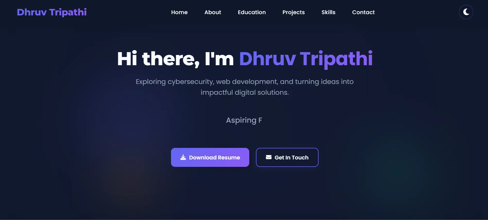

<div align='center'>
  
</div>

<div align="center">
  
</div>

<div align="center">
  <a href="https://dhruv-tripathi.netlify.app" target="_blank">
    
  </a>
  <a href="https://www.linkedin.com/in/dhruv-tripathi-758447288/" target="_blank">
    
  </a>
  <a href="mailto:youremail@example.com">
    
  </a>
</div>

<div align="center">
  
</div>

<br/>

<table align="center">
  <tr>
    <td>
      <h2 align="center"> About Me</h2>
      <ul>
        <li>I'm currently working on <b>Frontend Development</b></li>
        <li>I'm currently learning <b>Java & Backend Technologies</b></li>
        <li>I'm looking to collaborate on <b>Web Development Projects</b></li>
        <li>Ask me about <b>UI/UX Design & Frontend</b></li>
        <li>Fun fact: <b>I code better with music</b></li>
      </ul>
    </td>
    <td>
      
    </td>
  </tr>
</table>

---

<h2 align="center">
  <b>Skills & Technologies</b>
</h2>

<div align="center">
  <details open>
    <summary><b>Languages & Frameworks</b></summary>
    <br/>
    
    
    
    
    
  </details>

  <details>
    <summary><b>Tools & Software</b></summary>
    <br/>
    
    
    
    
    
  </details>
</div>

<br/>

<h2 align="center">My Skills</h2>

<div align="center">
  <!-- Skill bars with animation -->
  <div style="background: linear-gradient(to right, #00f7ff 90%, #0D1117 90%); height: 25px; border-radius: 5px; margin-bottom: 10px; position: relative; width: 80%; margin-left: auto; margin-right: auto;">
    <span style="position: absolute; left: 10px; top: 3px; color: white; font-weight: bold;">HTML/CSS - 90%</span>
  </div>
  <div style="background: linear-gradient(to right, #00f7ff 85%, #0D1117 85%); height: 25px; border-radius: 5px; margin-bottom: 10px; position: relative; width: 80%; margin-left: auto; margin-right: auto;">
    <span style="position: absolute; left: 10px; top: 3px; color: white; font-weight: bold;">JavaScript - 85%</span>
  </div>
  <div style="background: linear-gradient(to right, #00f7ff 70%, #0D1117 70%); height: 25px; border-radius: 5px; margin-bottom: 10px; position: relative; width: 80%; margin-left: auto; margin-right: auto;">
    <span style="position: absolute; left: 10px; top: 3px; color: white; font-weight: bold;">UI/UX Design - 70%</span>
  </div>
  
  <br/>
  
  ```text
  HTML/CSS        ██████████████████████░░░   90%
  JavaScript      ███████████████████░░░░░░   85%
  UI/UX Design    ███████████████░░░░░░░░░░   70%
  ```
</div>

---

<h2 align="center">
  <b>Currently Learning</b>
</h2>

<div align="center">
  <table align="center">
    <tr>
      <td align="center" width="120">
        <br>
        <strong>Java</strong>
        <br/><small>Backend Development</small>
      </td>
      <td align="center" width="120">
        <br>
        <strong>Advanced UI/UX</strong>
        <br/><small>Design Systems</small>
      </td>
      <td align="center" width="120">
        <br>
        <strong>API</strong>
        <br/><small>Integration & Testing</small>
      </td>
      <td align="center" width="120">
        <br>
        <strong>Responsive</strong>
        <br/><small>Web Design</small>
      </td>
    </tr>
  </table>
</div>

---

<h2 align="center">
  <b>Featured Projects</b>
</h2>

<div align="center">
  <a href="https://dhruv-tripathi.netlify.app" target="_blank">
    
  </a>
</div>

<div align="center">
  <table>
    <tr>
      <td width="50%" align="center">
        <h3>Portfolio Website</h3>
        <a href="https://dhruv-tripathi.netlify.app" target="_blank">
          
        </a>
        <p>Responsive portfolio showcasing my projects & skills</p>
        <p>
          
          
          
        </p>
      </td>
      <td width="50%" align="center">
        <h3>🚀 Coming Soon</h3>
        
        <p>Exciting new project in development</p>
        <p>Stay tuned for updates!</p>
      </td>
    </tr>
  </table>
</div>

---

<h2 align="center">
  <b>GitHub Analytics</b>
</h2>

<p align="center">
  <a href="https://github.com/DhruvTripathi">
    
  </a>
</p>

<p align="center">
  
</p>

<p align="center">
  
</p>

---

<h2 align="center">
  <b>Let's Connect</b>
</h2>

<div align="center">
  <table>
    <tr>
      <td align="center">
        <a href="https://dhruv-tripathi.netlify.app" target="_blank">
          
          <br>Portfolio
        </a>
      </td>
      <td align="center">
        <a href="https://www.linkedin.com/in/dhruv-tripathi-758447288/" target="_blank">
          
          <br>LinkedIn
        </a>
      </td>
    </tr>
  </table>
</div>

<br/>

<div align="center">
  
</div>

<div align="center">
  <h3>Let's build something amazing together!</h3>
</div>

<div align='center'>
  
</div>